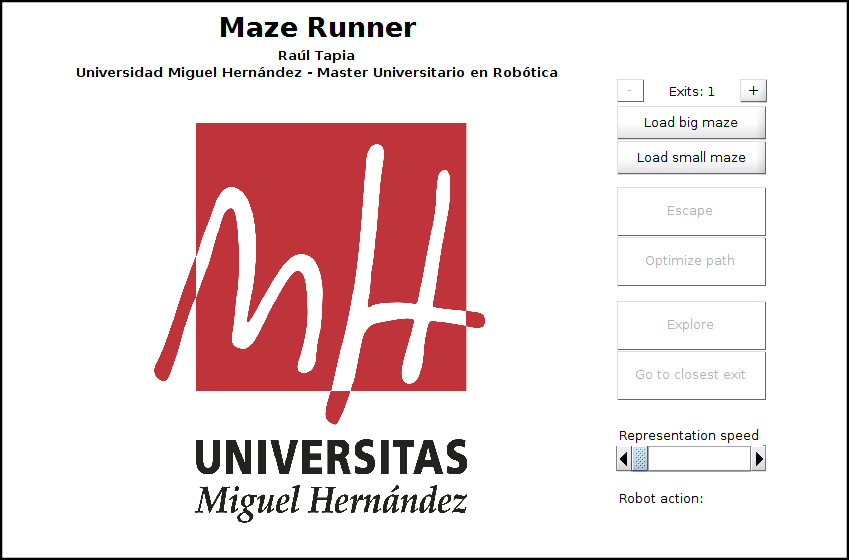
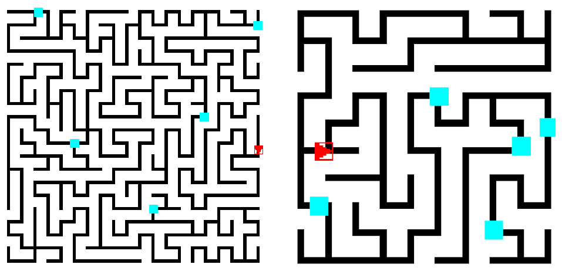
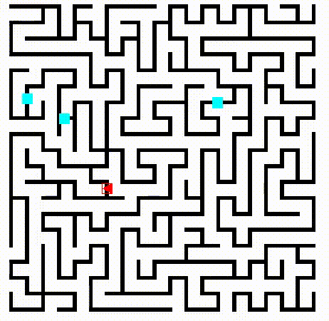
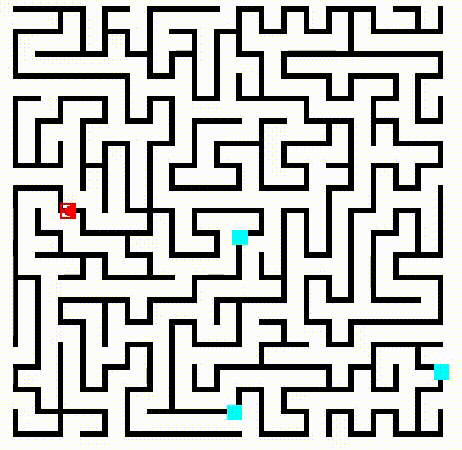
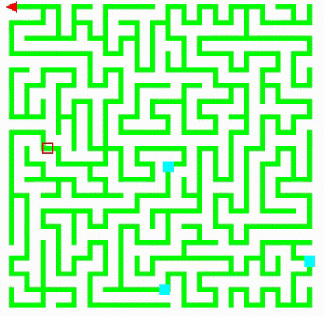

## Run
Run `demo.m` to start the simulator or use:
```
addpath('functions');
gui();
```

## Load a maze
Load a big or a small maze by pressing **LOAD BIG MAZE** or **LOAD SMALL MAZE**. The number of exits can be specified. Initial mobile robot pose and exits position are random.



## Escape
Press **ESCAPE** to start *right-hand rule* escape algorithm.



Press **OPTIMIZE PATH** to get the optimizal path when escape process is complete.


## Explore
Press **EXPLORE** to start *depth first search* algorithm. Exploration can be stopped at any time by pressing **STOP EXPLORATION**.



Press **GO TO CLOSEST EXIT** to move to the nearest exit. This can be done in any position after stopping exploration or when exploration is finished.


